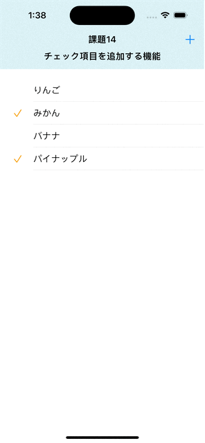

# 課題14 チェック項目を追加する機能
## Overview
<ul>
<li>4つのフルーツ名がリスト形式で表示される。</li>
<li>フルーツ名にはチェックマークが付いているものと付いていないものがある</li>
<li>フルーツ名を追加する機能を追加</li>
</ul>

<h2>Memo</h2>
<ul>
<li>SwiftUI</li>
<li>List</li>
<li>Label</li>
<li>Identifiable</li>
<li>ObservableObject/EnvironmentObject</li>
<li>@Environment</li>
<li>未入力や、空白スペースのときは追加されないようにした。.trimmingCharacters(in: .whitespaces)</li>

</ul>

